# AI Agent Framework - Documentation

## 📚 Complete Documentation Suite

Welcome to the comprehensive documentation for the AI Agent Framework. This documentation provides detailed visual diagrams, implementation guides, and deployment procedures to help you understand and implement the framework effectively.

## 📊 Documentation Structure

```mermaid
graph TD
    subgraph "Core Documentation"
        README[📖 Main README<br/>Framework Overview]
        
        subgraph "Visual Documentation"
            ARCH[🏗️ System Architecture<br/>Component relationships<br/>Processing flows<br/>Deployment views]
            
            DATA[📊 Data Flow Diagrams<br/>Processing pipelines<br/>Integration flows<br/>Error handling]
            
            IMPL[🎯 Implementation Guide<br/>Decision trees<br/>Best practices<br/>Patterns & strategies]
            
            DEPLOY[🚀 Deployment Guide<br/>Infrastructure setup<br/>Security configuration<br/>Monitoring & operations]
        end
        
        subgraph "Code Documentation"
            CONFIG[⚙️ Configuration System<br/>BaseConfig.gs<br/>Agent settings<br/>Runtime options]
            
            AGENTS[🤖 Agent Components<br/>InputParser<br/>ContentRetriever<br/>ResponseGenerator]
            
            UTILS[🔧 Utilities & Interfaces<br/>DataProvider<br/>Integration helpers<br/>Common functions]
            
            EXAMPLES[📝 Examples & Samples<br/>Sample implementations<br/>Use case patterns<br/>Template customizations]
        end
    end
    
    subgraph "Quick Start Guides"
        QS1[⚡ 5-Minute Setup<br/>Basic agent deployment]
        QS2[🎯 Custom Agent<br/>Specialized implementation]
        QS3[🔧 Advanced Features<br/>Complex configurations]
    end
    
    subgraph "Reference Materials"
        API[📋 API Reference<br/>Function signatures<br/>Parameter details<br/>Return values]
        
        TROUBLE[🛠️ Troubleshooting<br/>Common issues<br/>Debug procedures<br/>Error solutions]
        
        FAQ[❓ FAQ<br/>Frequently asked questions<br/>Best practices<br/>Performance tips]
    end
    
    %% Relationships
    README --> ARCH
    README --> DATA
    README --> IMPL
    README --> DEPLOY
    
    ARCH --> CONFIG
    DATA --> AGENTS
    IMPL --> UTILS
    DEPLOY --> EXAMPLES
    
    CONFIG --> QS1
    AGENTS --> QS2
    UTILS --> QS3
    
    QS1 --> API
    QS2 --> TROUBLE
    QS3 --> FAQ
    
    %% Styling
    classDef core fill:#E8F5E8
    classDef visual fill:#E3F2FD
    classDef code fill:#FFF3E0
    classDef quickstart fill:#FFEBEE
    classDef reference fill:#F3E5F5
    
    class README core
    class ARCH,DATA,IMPL,DEPLOY visual
    class CONFIG,AGENTS,UTILS,EXAMPLES code
    class QS1,QS2,QS3 quickstart
    class API,TROUBLE,FAQ reference
```

## 🗂️ Document Index

### 📋 Core Framework Documentation

| Document | Description | Diagrams |
|----------|-------------|----------|
| [**README.md**](../README.md) | Main framework overview and quick start guide | Architecture overview, Quick start examples |
| [**System Architecture**](system-architecture.md) | Complete system architecture and component relationships | 7 comprehensive architecture diagrams |
| [**Data Flow Diagrams**](data-flow-diagram.md) | Detailed data processing and integration flows | 8 detailed flow diagrams |
| [**Implementation Guide**](implementation-guide.md) | Implementation patterns and best practices | 6 implementation pattern diagrams |
| [**Deployment Guide**](deployment-guide.md) | Deployment strategies and operational procedures | 6 deployment and operations diagrams |

### 🔧 Component Documentation

| Component | File | Purpose |
|-----------|------|---------|
| **Configuration System** | `config/BaseConfig.gs` | Framework configuration and customization |
| **Input Parser Agent** | `core/agents/InputParserAgent.gs` | Natural language processing and intent classification |
| **Content Retriever Agent** | `core/agents/ContentRetrieverAgent.gs` | Data search and filtering with pluggable providers |
| **Response Generator Agent** | `core/agents/ResponseGeneratorAgent.gs` | Template and AI-powered response generation |
| **Framework Orchestrator** | `core/FrameworkOrchestrator.gs` | Main workflow coordination and error handling |
| **Data Provider Interface** | `core/utils/DataProviderInterface.gs` | Pluggable data source abstractions |
| **Sample Implementation** | `examples/SampleAgent.gs` | Complete working example with customization patterns |

### 📊 Visual Documentation Summary

#### 🏗️ System Architecture Diagrams
1. **Overall Architecture** - Complete system overview with all components
2. **Processing Flow** - Sequence diagram of agent interactions
3. **Component Architecture** - Detailed component relationships
4. **Configuration Architecture** - Configuration hierarchy and inheritance
5. **Deployment Architecture** - Infrastructure and service topology
6. **Use Case Scenarios** - Common usage patterns and adaptations
7. **Data Flow Patterns** - Information processing stages

#### 📊 Data Flow Diagrams
1. **Main Processing Pipeline** - Complete data transformation flow
2. **Intent Processing Flow** - Natural language understanding pipeline
3. **Content Retrieval Flow** - Data source integration and filtering
4. **Response Generation Flow** - Response creation and formatting
5. **Slack Integration Flow** - Communication platform integration
6. **Logging & Analytics Flow** - Monitoring and data collection
7. **Error Handling Flow** - Comprehensive error management

#### 🎯 Implementation Guide Diagrams
1. **Implementation Decision Tree** - Framework adoption decision flow
2. **Agent Development Lifecycle** - Development timeline and phases
3. **Implementation Checklist** - Step-by-step validation process
4. **Customization Patterns** - Framework extension strategies
5. **Configuration Management** - Settings and runtime adaptation
6. **Data Provider Selection** - Data source decision matrix
7. **Intent Design Patterns** - Intent modeling best practices
8. **Testing Strategy** - Comprehensive testing approach
9. **Performance Optimization** - Performance improvement strategies

#### 🚀 Deployment Guide Diagrams
1. **Deployment Architecture** - Infrastructure overview
2. **Deployment Process Flow** - Step-by-step deployment process
3. **Security Configuration** - Security controls and measures
4. **Monitoring & Observability** - Operations and monitoring setup
5. **Deployment Strategies** - Different deployment approaches
6. **Production Checklist** - Go-live validation process
7. **Incident Response** - Issue management and resolution

## 🚀 Quick Start Paths

### ⚡ 5-Minute Setup

```mermaid
graph LR
    A[📦 Copy Framework] --> B[⚙️ Set API Keys] --> C[🚀 Deploy Sample] --> D[✅ Test in Slack]
```

**Perfect for:** Proof of concept, quick demos, initial evaluation

**Documentation:** [Main README Quick Start](../README.md#quick-start)

### 🎯 Custom Agent (30 minutes)

```mermaid
graph LR
    A[📋 Define Requirements] --> B[🔧 Customize Config] --> C[📝 Create Templates] --> D[🧪 Test & Deploy]
```

**Perfect for:** Specific use cases, team-specific needs, production deployment

**Documentation:** [Implementation Guide](implementation-guide.md)

### 🏗️ Advanced Implementation (2-4 hours)

```mermaid
graph LR
    A[🎯 Architecture Design] --> B[🔌 Custom Providers] --> C[🧠 Advanced Logic] --> D[📊 Full Monitoring]
```

**Perfect for:** Enterprise deployment, complex integrations, multiple agents

**Documentation:** [Deployment Guide](deployment-guide.md)

## 🎯 Use Case Navigation

### 📚 Learning & Training
- **Goal:** Search and recommend training content
- **Start with:** [Sample Agent](../examples/SampleAgent.gs)
- **Customize:** Training-specific intents and content providers
- **Documentation:** [System Architecture](system-architecture.md)

### 🖥️ IT Support
- **Goal:** Troubleshooting assistance and knowledge base search
- **Start with:** Custom agent setup
- **Customize:** IT-specific intents and ticket integration
- **Documentation:** [Implementation Guide](implementation-guide.md)

### 👥 HR Services  
- **Goal:** Policy lookup and employee assistance
- **Start with:** Custom configuration
- **Customize:** HR-specific templates and privacy controls
- **Documentation:** [Data Flow Diagrams](data-flow-diagram.md)

### 🎫 Customer Support
- **Goal:** FAQ responses and issue escalation
- **Start with:** Framework orchestrator customization
- **Customize:** Customer-facing templates and escalation workflows
- **Documentation:** [Deployment Guide](deployment-guide.md)

## 🔍 Finding Information

### 🎯 By Goal
| What you want to do | Start here |
|---------------------|------------|
| **Understand the framework** | [System Architecture](system-architecture.md) |
| **See data flow** | [Data Flow Diagrams](data-flow-diagram.md) |
| **Implement an agent** | [Implementation Guide](implementation-guide.md) |
| **Deploy to production** | [Deployment Guide](deployment-guide.md) |
| **Customize components** | [Sample Agent](../examples/SampleAgent.gs) |
| **Troubleshoot issues** | [Error Handling Flow](data-flow-diagram.md#error-handling-flow) |

### 🔧 By Component
| Component | Architecture | Implementation | Deployment |
|-----------|-------------|----------------|------------|
| **InputParser** | [Component Architecture](system-architecture.md#component-architecture) | [Intent Design](implementation-guide.md#intent-design-patterns) | [Configuration](deployment-guide.md#configuration-deployment) |
| **ContentRetriever** | [Data Layer](system-architecture.md#data-layer) | [Provider Selection](implementation-guide.md#data-provider-selection-guide) | [Data Security](deployment-guide.md#security-configuration) |
| **ResponseGenerator** | [Response Processing](data-flow-diagram.md#response-generation-flow) | [Template Patterns](implementation-guide.md#customization-patterns) | [Monitoring](deployment-guide.md#monitoring--observability) |
| **Orchestrator** | [Processing Flow](system-architecture.md#processing-flow) | [Error Handling](implementation-guide.md#testing-strategy) | [Incident Response](deployment-guide.md#incident-response) |

### 📊 By Diagram Type
| Diagram Type | Best for understanding |
|--------------|----------------------|
| **Flowcharts** | Process flows, decision trees, workflows |
| **Sequence Diagrams** | Interactions, API calls, time-based flows |
| **Component Diagrams** | System structure, relationships, dependencies |
| **Deployment Diagrams** | Infrastructure, environments, integrations |

## 🎨 Diagram Legend

### 🎨 Color Coding
- 🟢 **Green** - User interfaces and input points
- 🔵 **Blue** - Core framework components  
- 🟡 **Yellow** - Configuration and settings
- 🟠 **Orange** - Data sources and providers
- 🔴 **Red** - External services and APIs
- 🟣 **Purple** - Monitoring and operations

### 📱 Icons Reference
- 🧠 AI/ML components (OpenAI, processing)
- 📊 Data components (sheets, databases)
- 💬 Communication (Slack, webhooks)
- ⚙️ Configuration and settings
- 🔍 Search and filtering
- 📝 Content and responses
- 🚨 Monitoring and alerts
- 🔐 Security and authentication

## 📞 Support & Feedback

### 🆘 Getting Help
1. **Check Documentation** - Start with relevant diagram sections
2. **Review Examples** - Look at sample implementations
3. **Test with Mock Data** - Use built-in testing capabilities
4. **Check Logs** - Review Google Apps Script execution logs

### 💡 Contributing
- **Report Issues** - Documentation gaps or errors
- **Suggest Improvements** - Additional diagrams or examples
- **Share Use Cases** - New implementation patterns
- **Contribute Examples** - Working agent implementations

---

**📖 Documentation maintained with ❤️ by the AI Agent Framework team**

*Last updated: Generated with comprehensive visual documentation suite* 