# AI Agent Framework - Data Flow Diagrams

## 📊 Complete Data Flow Architecture

This document visualizes how data flows through the AI Agent Framework from user input to final response, including all processing stages and data transformations.

## 🔄 Main Processing Pipeline

```mermaid
flowchart TB
    subgraph "Input Stage"
        UI[👤 User Input<br/>"Find QA training"]
        UVF[User Input Validation]
        UCI[User Context Integration]
    end
    
    subgraph "Parsing Stage"
        subgraph "InputParserAgent"
            ISP[Input Sanitization<br/>& Preprocessing]
            OAI1[OpenAI API Call<br/>Intent Classification]
            IPP[Intent & Parameter<br/>Processing]
            LNG[Language Detection<br/>& Configuration]
        end
    end
    
    subgraph "Data Retrieval Stage"
        subgraph "ContentRetrieverAgent"
            DPC[Data Provider<br/>Configuration]
            DLD[Data Loading<br/>from Sources]
            DFT[Data Filtering<br/>by Category/Role]
            DKF[Keyword Filtering<br/>& Processing]
            DSR[Data Sorting<br/>& Ranking]
        end
        
        subgraph "Data Sources"
            DS1[📊 Google Sheets<br/>Structured Data]
            DS2[🌐 REST APIs<br/>External Data]
            DS3[📋 JSON Files<br/>Static Data]
            DS4[🧪 Mock Data<br/>Testing Data]
        end
    end
    
    subgraph "Response Generation Stage"
        subgraph "ResponseGeneratorAgent"
            RTC[Response Type<br/>Classification]
            TMR[Template-based<br/>Response]
            AIR[AI-powered<br/>Response]
            RFT[Response Formatting<br/>& Platform Adaptation]
        end
    end
    
    subgraph "Output Stage"
        subgraph "Integration Layer"
            SLK[💬 Slack Integration<br/>Threading & Mentions]
            WEB[🌐 Webhook Integration<br/>External Systems]
            LOG[📊 Logging Integration<br/>Analytics & Monitoring]
        end
        
        UR[👤 User Response<br/>Formatted Output]
    end
    
    %% Main Flow
    UI --> UVF
    UVF --> UCI
    UCI --> ISP
    
    ISP --> OAI1
    OAI1 --> IPP
    IPP --> LNG
    
    LNG --> DPC
    DPC --> DLD
    DLD --> DFT
    DFT --> DKF
    DKF --> DSR
    
    %% Data Sources
    DLD --> DS1
    DLD --> DS2
    DLD --> DS3
    DLD --> DS4
    
    DSR --> RTC
    RTC --> TMR
    RTC --> AIR
    TMR --> RFT
    AIR --> RFT
    
    RFT --> SLK
    RFT --> WEB
    RFT --> LOG
    
    SLK --> UR
    
    %% Styling
    classDef inputStage fill:#E8F5E8
    classDef parseStage fill:#E3F2FD
    classDef dataStage fill:#FFF3E0
    classDef responseStage fill:#FFEBEE
    classDef outputStage fill:#F3E5F5
    classDef dataSource fill:#FAFAFA
    
    class UI,UVF,UCI inputStage
    class ISP,OAI1,IPP,LNG parseStage
    class DPC,DLD,DFT,DKF,DSR dataStage
    class RTC,TMR,AIR,RFT responseStage
    class SLK,WEB,LOG,UR outputStage
    class DS1,DS2,DS3,DS4 dataSource
```

## 🧠 Intent Processing Flow

```mermaid
flowchart LR
    subgraph "Input Analysis"
        RAW[Raw User Input<br/>"Show me Go programming courses"]
        CLN[Cleaned Input<br/>"Go programming courses"]
        CTX[Context Integration<br/>Thread + User Info]
    end
    
    subgraph "OpenAI Processing"
        SYS[System Prompt<br/>Intent Classification Rules]
        USR[User Prompt<br/>Enhanced Input]
        MDL[GPT-3.5-turbo<br/>AI Processing]
        RSP[AI Response<br/>JSON Structure]
    end
    
    subgraph "Result Processing"
        JSON[JSON Parsing<br/>Intent Extraction]
        VAL[Validation<br/>Against Intent Definitions]
        ENH[Result Enhancement<br/>Confidence + Language]
    end
    
    subgraph "Output Structure"
        INT[Intent: "search_by_category"]
        PAR[Parameters:<br/>{category: "programming",<br/>keywords: ["Go"],<br/>language: "english"}]
        CON[Confidence: 0.9]
        LAN[Language: "english"]
    end
    
    %% Flow
    RAW --> CLN
    CLN --> CTX
    CTX --> USR
    
    SYS --> MDL
    USR --> MDL
    MDL --> RSP
    
    RSP --> JSON
    JSON --> VAL
    VAL --> ENH
    
    ENH --> INT
    ENH --> PAR
    ENH --> CON
    ENH --> LAN
    
    %% Styling
    classDef input fill:#E8F5E8
    classDef openai fill:#E3F2FD
    classDef processing fill:#FFF3E0
    classDef output fill:#FFEBEE
    
    class RAW,CLN,CTX input
    class SYS,USR,MDL,RSP openai
    class JSON,VAL,ENH processing
    class INT,PAR,CON,LAN output
```

## 🔍 Content Retrieval Flow


## 📝 Response Generation Flow

```mermaid
flowchart LR
    subgraph "Input Processing"
        INT[Intent<br/>"search_by_category"]
        PAR[Parameters<br/>{category: "QA"}]
        RES[Search Results<br/>3 QA Courses]
        CFG[Agent Configuration<br/>Templates & Settings]
    end
    
    subgraph "Response Type Decision"
        TYP[Response Type<br/>Determination]
        
        subgraph "Type Options"
            RF[Results Found<br/>Show Content]
            NR[No Results<br/>Suggestions]
            HLP[Help Request<br/>Instructions]
            ERR[Error Occurred<br/>Fallback]
        end
    end
    
    subgraph "Response Generation"
        subgraph "Template-based"
            TMP[Template Selection<br/>Language + Type]
            FMT[Format Application<br/>Header + Items + Footer]
            VAR[Variable Replacement<br/>{title}, {description}]
        end
        
        subgraph "AI-powered"
            SYS2[System Prompt<br/>Response Guidelines]
            CTX[Context Preparation<br/>Results + Intent]
            OAI2[OpenAI API Call<br/>Response Generation]
            AIR[AI Response<br/>Natural Language]
        end
    end
    
    subgraph "Post-processing"
        LNG[Language Formatting<br/>English/Japanese]
        PLT[Platform Formatting<br/>Slack/Web/API]
        CLN[Cleanup & Validation<br/>Final Checks]
    end
    
    subgraph "Output"
        FIN[Final Response<br/>Ready for Delivery]
        META[Response Metadata<br/>Type/Length/Language]
    end
    
    %% Flow
    INT --> TYP
    PAR --> TYP
    RES --> TYP
    CFG --> TYP
    
    TYP --> RF
    TYP --> NR
    TYP --> HLP
    TYP --> ERR
    
    %% Template Path
    RF --> TMP
    NR --> TMP
    HLP --> TMP
    TMP --> FMT
    FMT --> VAR
    
    %% AI Path
    RF --> SYS2
    SYS2 --> CTX
    CTX --> OAI2
    OAI2 --> AIR
    
    %% Post-processing
    VAR --> LNG
    AIR --> LNG
    LNG --> PLT
    PLT --> CLN
    
    CLN --> FIN
    CLN --> META
    
    %% Styling
    classDef input fill:#E8F5E8
    classDef decision fill:#E3F2FD
    classDef generation fill:#FFF3E0
    classDef postproc fill:#FFEBEE
    classDef output fill:#F3E5F5
    
    class INT,PAR,RES,CFG input
    class TYP,RF,NR,HLP,ERR decision
    class TMP,FMT,VAR,SYS2,CTX,OAI2,AIR generation
    class LNG,PLT,CLN postproc
    class FIN,META output
```

## 🔄 Slack Integration Flow

```mermaid
sequenceDiagram
    participant User as 👤 User
    participant Slack as 💬 Slack
    participant Framework as 🎯 Framework
    participant Agent as 🤖 Agent
    participant OpenAI as 🧠 OpenAI
    participant Sheets as 📊 Sheets
    
    Note over User,Sheets: User Interaction Flow
    
    User->>Slack: @Bot "Find QA training"
    Slack->>Framework: Message Event
    
    Note over Framework: Message Processing
    Framework->>Framework: Extract user input
    Framework->>Framework: Clean mentions
    Framework->>Framework: Get user context
    
    Note over Framework,Agent: Agent Processing
    Framework->>Agent: Process request
    Agent->>OpenAI: Parse intent
    OpenAI-->>Agent: Intent + parameters
    Agent->>Sheets: Load content data
    Sheets-->>Agent: Training content
    Agent->>Agent: Filter & process
    Agent->>OpenAI: Generate response
    OpenAI-->>Agent: Formatted response
    Agent-->>Framework: Final response
    
    Note over Framework,Slack: Response Delivery
    Framework->>Framework: Add user mention
    Framework->>Framework: Format for Slack
    Framework->>Slack: Post message
    Slack-->>Framework: Message posted (ts)
    Framework->>Sheets: Log interaction
    Slack->>User: Show response
    
    Note over User,Sheets: Thread Follow-up
    User->>Slack: "Tell me more" (in thread)
    Slack->>Framework: Thread reply event
    Framework->>Framework: Get thread context
    Framework->>Agent: Process with context
    Agent->>Agent: Enhanced processing
    Agent-->>Framework: Contextual response
    Framework->>Slack: Reply in thread
    Slack->>User: Show thread response
```



## 📊 Logging & Analytics Flow


## 🔄 Error Handling Flow

