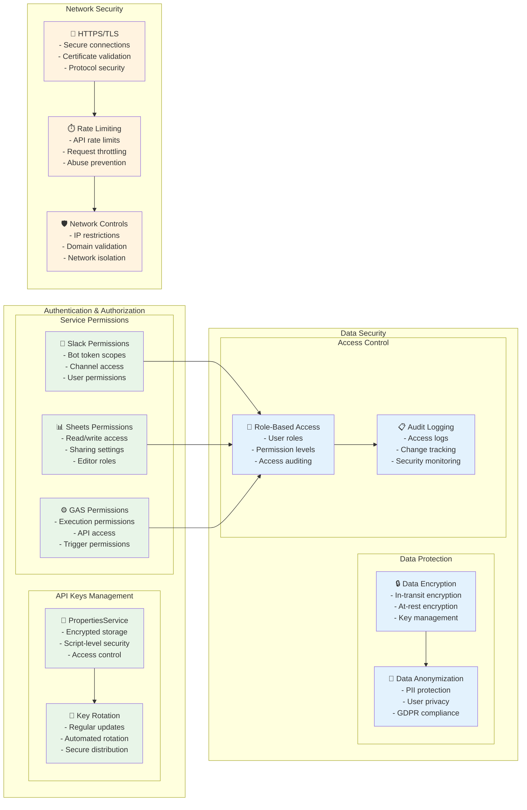
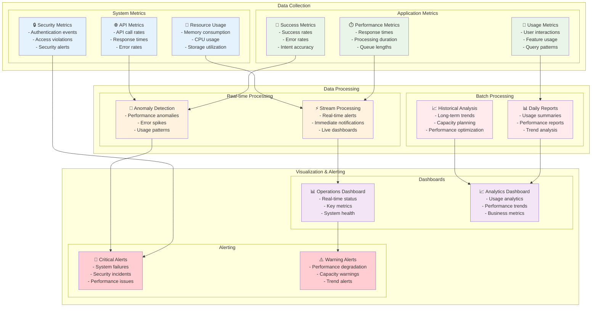
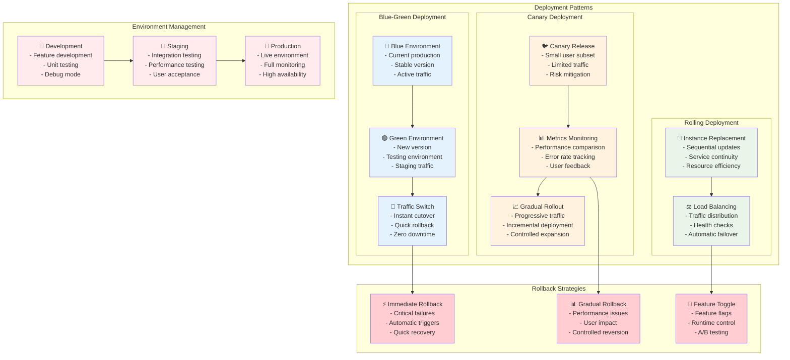
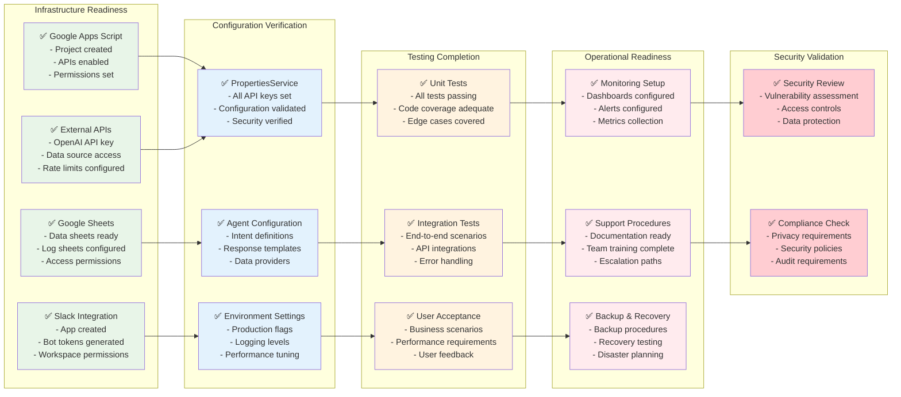
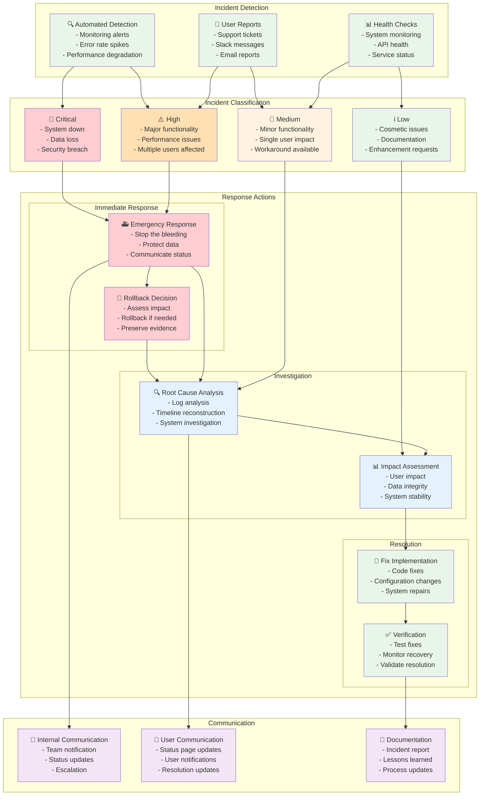

# AI Agent Framework - Deployment Guide

## 🚀 Deployment Architecture & Processes

This guide provides visual representations of deployment strategies, infrastructure requirements, and operational procedures for AI Agent Framework implementations.

## 🏗️ Deployment Architecture Overview

```mermaid
graph TB
    subgraph "Development Environment"
        DEV[👨‍💻 Developer Workspace<br/>- Local testing<br/>- Mock data<br/>- Debug mode]
        
        GIT[📝 Version Control<br/>- Source code<br/>- Configuration<br/>- Documentation]
    end
    
    subgraph "Google Cloud Platform"
        subgraph "Google Apps Script"
            GAS1[🔧 Development Project<br/>- Testing environment<br/>- Limited access<br/>- Debug logging]
            
            GAS2[🚀 Production Project<br/>- Live environment<br/>- Full access<br/>- Performance logging]
        end
        
        subgraph "Google Workspace"
            SHEETS[📊 Google Sheets<br/>- Data storage<br/>- Logging<br/>- Configuration]
            
            DRIVE[💾 Google Drive<br/>- File storage<br/>- Backups<br/>- Resources]
        end
    end
    
    subgraph "External Services"
        OPENAI[🧠 OpenAI<br/>- API endpoints<br/>- Model access<br/>- Rate limiting]
        
        SLACK[💬 Slack Workspace<br/>- Bot application<br/>- Channels<br/>- User access]
        
        APIS[🌐 External APIs<br/>- Data sources<br/>- Integrations<br/>- Webhooks]
    end
    
    subgraph "Monitoring & Operations"
        LOGS[📋 Logging System<br/>- Error tracking<br/>- Performance metrics<br/>- Usage analytics]
        
        ALERTS[🚨 Alert System<br/>- Error notifications<br/>- Performance alerts<br/>- Capacity warnings]
        
        BACKUP[💾 Backup System<br/>- Data backup<br/>- Configuration backup<br/>- Recovery procedures]
    end
    
    %% Development Flow
    DEV --> GIT
    GIT --> GAS1
    GAS1 --> GAS2
    
    %% Platform Integrations
    GAS1 --> SHEETS
    GAS2 --> SHEETS
    GAS2 --> DRIVE
    
    %% External Connections
    GAS2 --> OPENAI
    GAS2 --> SLACK
    GAS2 --> APIS
    
    %% Operations
    GAS2 --> LOGS
    LOGS --> ALERTS
    SHEETS --> BACKUP
    
    %% Styling
    classDef development fill:#E8F5E8
    classDef google fill:#E3F2FD
    classDef external fill:#FFF3E0
    classDef operations fill:#FFEBEE
    
    class DEV,GIT development
    class GAS1,GAS2,SHEETS,DRIVE google
    class OPENAI,SLACK,APIS external
    class LOGS,ALERTS,BACKUP operations
```

## 🔧 Deployment Process Flow

```mermaid
flowchart TD
    subgraph "Pre-Deployment"
        REQ[📋 Requirements Check<br/>- API keys ready<br/>- Permissions configured<br/>- Testing completed]
        
        ENV[🌍 Environment Setup<br/>- Google Workspace access<br/>- Slack workspace access<br/>- OpenAI account]
        
        PLAN[📝 Deployment Plan<br/>- Timeline<br/>- Rollback strategy<br/>- Communication plan]
    end
    
    subgraph "Infrastructure Setup"
        GAS_SETUP[⚙️ Google Apps Script<br/>- Create new project<br/>- Enable required APIs<br/>- Set up execution triggers]
        
        SHEET_SETUP[📊 Google Sheets Setup<br/>- Create data sheets<br/>- Set up log sheets<br/>- Configure permissions]
        
        SLACK_SETUP[💬 Slack App Setup<br/>- Create Slack app<br/>- Configure permissions<br/>- Install to workspace]
    end
    
    subgraph "Configuration Deployment"
        CODE_DEPLOY[📦 Code Deployment<br/>- Upload framework files<br/>- Deploy agent logic<br/>- Configure entry points]
        
        CONFIG_DEPLOY[⚙️ Configuration Setup<br/>- PropertiesService setup<br/>- API key configuration<br/>- Agent customization]
        
        DATA_DEPLOY[📊 Data Deployment<br/>- Upload data sources<br/>- Configure providers<br/>- Validate data access]
    end
    
    subgraph "Testing & Validation"
        SMOKE[🧪 Smoke Tests<br/>- Basic functionality<br/>- API connectivity<br/>- Configuration validation]
        
        INTEGRATION[🔗 Integration Tests<br/>- End-to-end workflows<br/>- External API tests<br/>- Error handling]
        
        USER_TEST[👥 User Acceptance<br/>- Real user scenarios<br/>- Performance validation<br/>- Feedback collection]
    end
    
    subgraph "Go-Live"
        ENABLE[🚀 Enable Production<br/>- Activate triggers<br/>- Enable monitoring<br/>- Start logging]
        
        MONITOR[📊 Initial Monitoring<br/>- Watch for errors<br/>- Monitor performance<br/>- Validate functionality]
        
        SUPPORT[🆘 Support Readiness<br/>- Documentation ready<br/>- Support team trained<br/>- Escalation procedures]
    end
    
    %% Flow
    REQ --> ENV --> PLAN
    PLAN --> GAS_SETUP --> SHEET_SETUP --> SLACK_SETUP
    SLACK_SETUP --> CODE_DEPLOY --> CONFIG_DEPLOY --> DATA_DEPLOY
    DATA_DEPLOY --> SMOKE --> INTEGRATION --> USER_TEST
    USER_TEST --> ENABLE --> MONITOR --> SUPPORT
    
    %% Styling
    classDef predeployment fill:#E8F5E8
    classDef infrastructure fill:#E3F2FD
    classDef configuration fill:#FFF3E0
    classDef testing fill:#FFEBEE
    classDef golive fill:#F3E5F5
    
    class REQ,ENV,PLAN predeployment
    class GAS_SETUP,SHEET_SETUP,SLACK_SETUP infrastructure
    class CODE_DEPLOY,CONFIG_DEPLOY,DATA_DEPLOY configuration
    class SMOKE,INTEGRATION,USER_TEST testing
    class ENABLE,MONITOR,SUPPORT golive
```

## 🔐 Security Configuration

## 📊 Monitoring & Observability

## 🔄 Deployment Strategies

## 📋 Production Checklist

## 🚨 Incident Response

