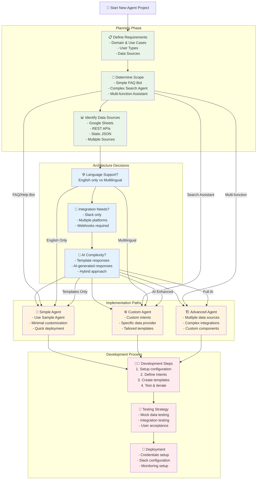
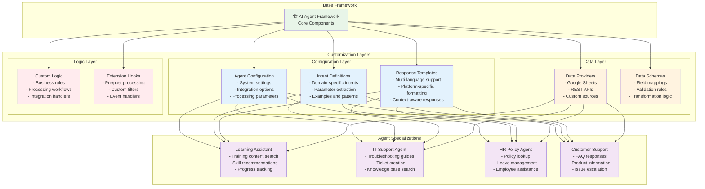
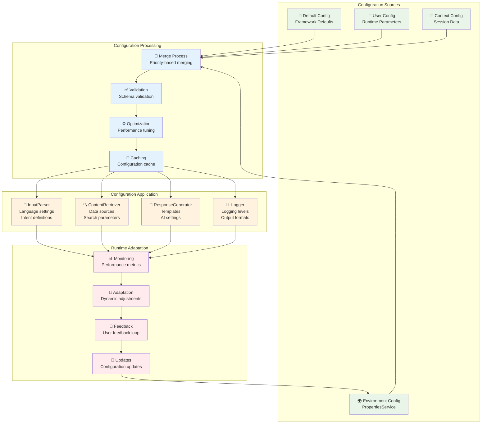
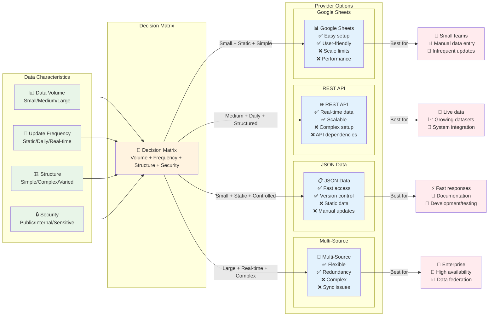
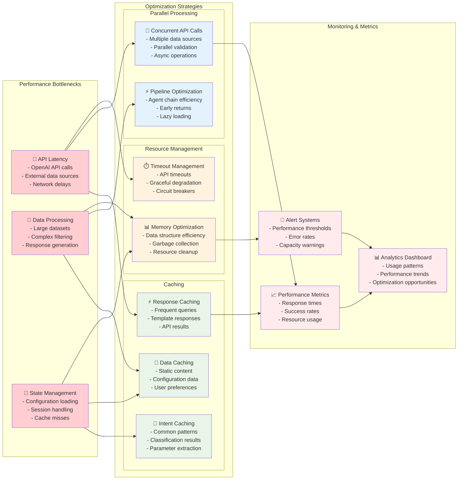

# AI Agent Framework - Implementation Guide

## 🎯 Implementation Patterns & Best Practices

This guide provides visual representations of common implementation patterns, decision trees, and best practices for building AI agents with the framework.

## 🚀 Implementation Decision Tree

## 🏗️ Agent Development Lifecycle

```mermaid
gantt
    title AI Agent Development Timeline
    dateFormat X
    axisFormat %d
    
    section Planning
    Requirements Analysis          :planning1, 0, 3d
    Architecture Design           :planning2, after planning1, 2d
    Data Source Planning          :planning3, after planning1, 2d
    
    section Setup
    Framework Installation        :setup1, after planning2, 1d
    Configuration Setup          :setup2, after setup1, 1d
    Credentials Configuration    :setup3, after setup2, 1d
    
    section Development
    Intent Definitions           :dev1, after setup3, 2d
    Data Provider Setup          :dev2, after setup3, 2d
    Response Templates           :dev3, after dev1, 2d
    Agent Logic Implementation   :dev4, after dev2, 3d
    
    section Testing
    Unit Testing                 :test1, after dev3, 2d
    Integration Testing          :test2, after dev4, 2d
    User Acceptance Testing      :test3, after test2, 2d
    
    section Deployment
    Production Setup             :deploy1, after test3, 1d
    Monitoring Configuration     :deploy2, after deploy1, 1d
    Documentation                :deploy3, after deploy1, 2d
    
    section Maintenance
    Performance Monitoring       :maint1, after deploy2, 30d
    User Feedback Integration    :maint2, after deploy3, 30d
```

## 📋 Implementation Checklist

```mermaid
flowchart LR
    subgraph "Pre-Development"
        C1[✅ Define agent purpose<br/>and scope]
        C2[✅ Identify user personas<br/>and use cases]
        C3[✅ Map data sources<br/>and access methods]
        C4[✅ Design conversation<br/>flows and intents]
    end
    
    subgraph "Configuration"
        C5[✅ Set up Google Apps<br/>Script project]
        C6[✅ Configure PropertiesService<br/>with API keys]
        C7[✅ Create Google Sheets<br/>for data and logs]
        C8[✅ Set up Slack app<br/>and permissions]
    end
    
    subgraph "Development"
        C9[✅ Define intent<br/>definitions]
        C10[✅ Create response<br/>templates]
        C11[✅ Configure data<br/>provider]
        C12[✅ Customize agent<br/>configuration]
    end
    
    subgraph "Testing"
        C13[✅ Test with mock<br/>data]
        C14[✅ Test intent<br/>classification]
        C15[✅ Test response<br/>generation]
        C16[✅ Test Slack<br/>integration]
    end
    
    subgraph "Deployment"
        C17[✅ Deploy to<br/>production]
        C18[✅ Set up monitoring<br/>and alerts]
        C19[✅ Create user<br/>documentation]
        C20[✅ Train users and<br/>gather feedback]
    end
    
    %% Flow
    C1 --> C2 --> C3 --> C4
    C4 --> C5 --> C6 --> C7 --> C8
    C8 --> C9 --> C10 --> C11 --> C12
    C12 --> C13 --> C14 --> C15 --> C16
    C16 --> C17 --> C18 --> C19 --> C20
    
    %% Styling
    classDef predev fill:#E8F5E8
    classDef config fill:#E3F2FD
    classDef development fill:#FFF3E0
    classDef testing fill:#FFEBEE
    classDef deployment fill:#F3E5F5
    
    class C1,C2,C3,C4 predev
    class C5,C6,C7,C8 config
    class C9,C10,C11,C12 development
    class C13,C14,C15,C16 testing
    class C17,C18,C19,C20 deployment
```

## 🎨 Customization Patterns

## 🔧 Configuration Management Pattern

## 📊 Data Provider Selection Guide

## 🎯 Intent Design Patterns

```mermaid
graph TD
    subgraph "Intent Categories"
        subgraph "Search Intents"
            SC[🔍 search_by_category<br/>- Category-based filtering<br/>- Keyword enhancement<br/>- Level specification]
            
            SR[👥 search_by_role<br/>- Role-based targeting<br/>- Audience segmentation<br/>- Skill mapping]
            
            SF[🎯 search_by_filter<br/>- Multi-criteria search<br/>- Advanced filtering<br/>- Complex queries]
        end
        
        subgraph "Action Intents"
            CR[📝 create_request<br/>- Form submission<br/>- Data collection<br/>- Workflow initiation]
            
            UP[🔄 update_status<br/>- State changes<br/>- Progress tracking<br/>- Notifications]
            
            DL[📥 download_content<br/>- File access<br/>- Resource delivery<br/>- Format conversion]
        end
        
        subgraph "Information Intents"
            GI[ℹ️ get_info<br/>- Fact retrieval<br/>- Definition lookup<br/>- Quick answers]
            
            GH[❓ get_help<br/>- Usage instructions<br/>- Feature explanations<br/>- Troubleshooting]
            
            GS[📊 get_status<br/>- System status<br/>- Progress reports<br/>- Health checks]
        end
    end
    
    subgraph "Intent Parameters"
        subgraph "Common Parameters"
            CAT[category: string<br/>Business domain]
            KEY[keywords: array<br/>Search terms]
            LVL[level: enum<br/>Difficulty/priority]
            LNG[language: string<br/>Response language]
        end
        
        subgraph "Context Parameters"
            USR[user_id: string<br/>User identification]
            CHN[channel: string<br/>Communication channel]
            THR[thread_id: string<br/>Conversation context]
            TST[timestamp: datetime<br/>Time context]
        end
        
        subgraph "Filter Parameters"
            TYP[type: enum<br/>Content type]
            TAG[tags: array<br/>Metadata tags]
            DUR[duration: range<br/>Time/length filters]
            FMT[format: enum<br/>Output format]
        end
    end
    
    subgraph "Intent Relationships"
        FLW[🔄 Intent Flow<br/>Sequential intents]
        FAL[⚡ Fallback Chain<br/>Alternative intents]
        CMB[🔗 Combined Intents<br/>Multi-step processes]
    end
    
    %% Relationships
    SC --> CAT
    SC --> KEY
    SC --> LVL
    
    SR --> CAT
    SR --> USR
    SR --> LVL
    
    CR --> USR
    CR --> CHN
    CR --> TST
    
    GI --> KEY
    GI --> LNG
    GI --> FMT
    
    %% Intent Flows
    SC --> FLW
    SR --> FLW
    GI --> FAL
    GH --> FAL
    
    %% Styling
    classDef search fill:#E8F5E8
    classDef action fill:#E3F2FD
    classDef info fill:#FFF3E0
    classDef common fill:#FFEBEE
    classDef context fill:#F3E5F5
    classDef filter fill:#FAFAFA
    classDef relations fill:#E1F5FE
    
    class SC,SR,SF search
    class CR,UP,DL action
    class GI,GH,GS info
    class CAT,KEY,LVL,LNG common
    class USR,CHN,THR,TST context
    class TYP,TAG,DUR,FMT filter
    class FLW,FAL,CMB relations
```

## 🧪 Testing Strategy

```mermaid
flowchart TB
    subgraph "Testing Levels"
        subgraph "Unit Testing"
            UT1[🧩 Component Testing<br/>- Individual agents<br/>- Utility functions<br/>- Configuration logic]
            
            UT2[📊 Data Provider Testing<br/>- Mock data loading<br/>- Error handling<br/>- Performance testing]
            
            UT3[🎯 Intent Testing<br/>- Classification accuracy<br/>- Parameter extraction<br/>- Edge cases]
        end
        
        subgraph "Integration Testing"
            IT1[🔗 Agent Chain Testing<br/>- End-to-end flow<br/>- Agent interactions<br/>- Data transformation]
            
            IT2[🌐 API Integration<br/>- OpenAI API calls<br/>- Slack API integration<br/>- External data sources]
            
            IT3[⚙️ Configuration Testing<br/>- Environment setup<br/>- Credential management<br/>- Runtime adaptation]
        end
        
        subgraph "User Acceptance Testing"
            UAT1[👥 User Scenario Testing<br/>- Real user workflows<br/>- Business use cases<br/>- Edge case handling]
            
            UAT2[🎭 Role-based Testing<br/>- Different user types<br/>- Permission levels<br/>- Access patterns]
            
            UAT3[🌍 Multi-language Testing<br/>- Language detection<br/>- Response formatting<br/>- Cultural adaptation]
        end
    end
    
    subgraph "Testing Tools & Methods"
        subgraph "Automated Testing"
            AUTO1[🤖 Test Scripts<br/>- Automated test suites<br/>- Regression testing<br/>- Performance monitoring]
            
            AUTO2[📊 Mock Services<br/>- Mock data providers<br/>- API simulators<br/>- Error injection]
        end
        
        subgraph "Manual Testing"
            MAN1[👨‍💻 Developer Testing<br/>- Code review<br/>- Debug sessions<br/>- Performance analysis]
            
            MAN2[👥 User Testing<br/>- Beta testing<br/>- Feedback collection<br/>- Usability studies]
        end
    end
    
    subgraph "Testing Data"
        TD1[📊 Test Datasets<br/>- Comprehensive coverage<br/>- Edge cases<br/>- Real-world scenarios]
        
        TD2[🧪 Mock Scenarios<br/>- Controlled testing<br/>- Predictable outcomes<br/>- Isolated testing]
        
        TD3[📈 Performance Data<br/>- Load testing<br/>- Stress testing<br/>- Capacity planning]
    end
    
    %% Relationships
    UT1 --> AUTO1
    UT2 --> AUTO2
    UT3 --> TD2
    
    IT1 --> AUTO1
    IT2 --> MAN1
    IT3 --> TD1
    
    UAT1 --> MAN2
    UAT2 --> TD1
    UAT3 --> TD3
    
    %% Styling
    classDef unit fill:#E8F5E8
    classDef integration fill:#E3F2FD
    classDef acceptance fill:#FFF3E0
    classDef automated fill:#FFEBEE
    classDef manual fill:#F3E5F5
    classDef data fill:#FAFAFA
    
    class UT1,UT2,UT3 unit
    class IT1,IT2,IT3 integration
    class UAT1,UAT2,UAT3 acceptance
    class AUTO1,AUTO2 automated
    class MAN1,MAN2 manual
    class TD1,TD2,TD3 data
```

## 📈 Performance Optimization

