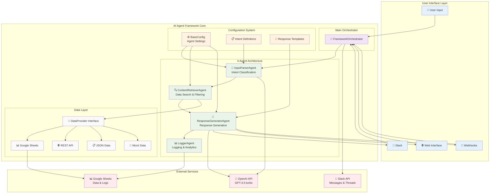
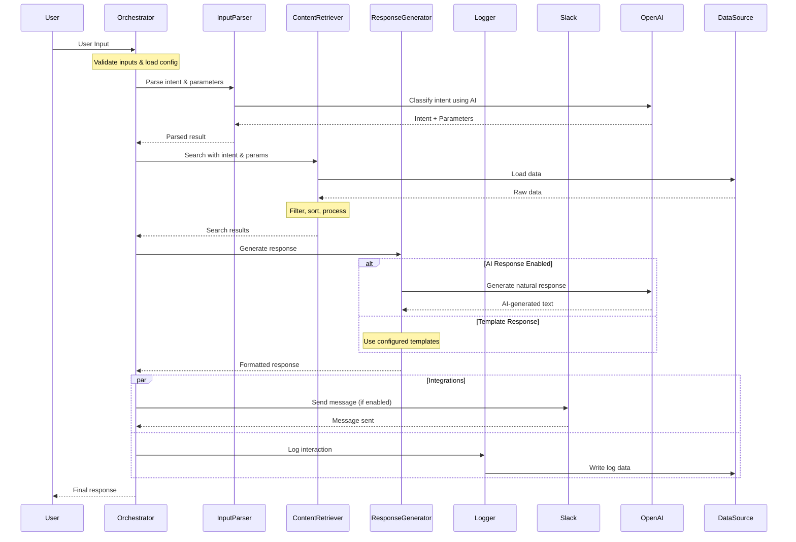
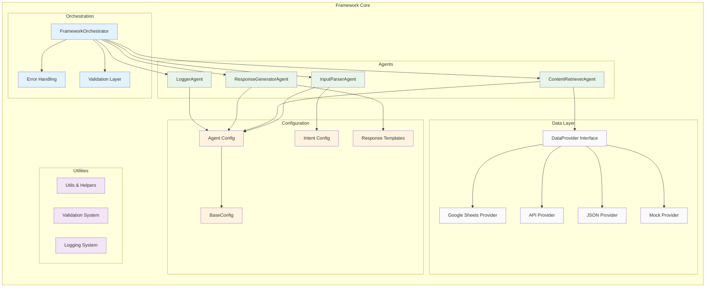
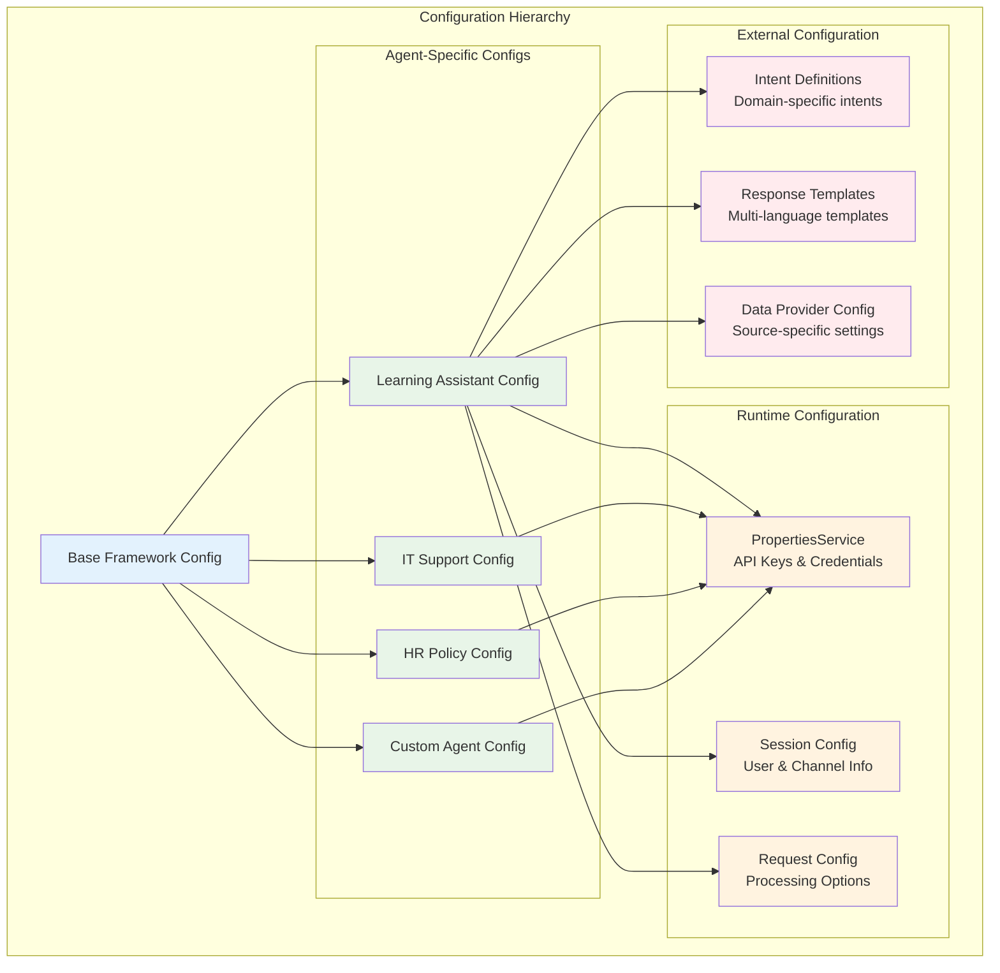
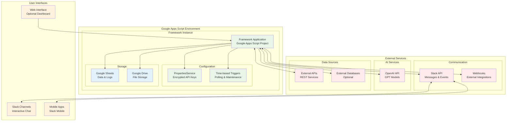
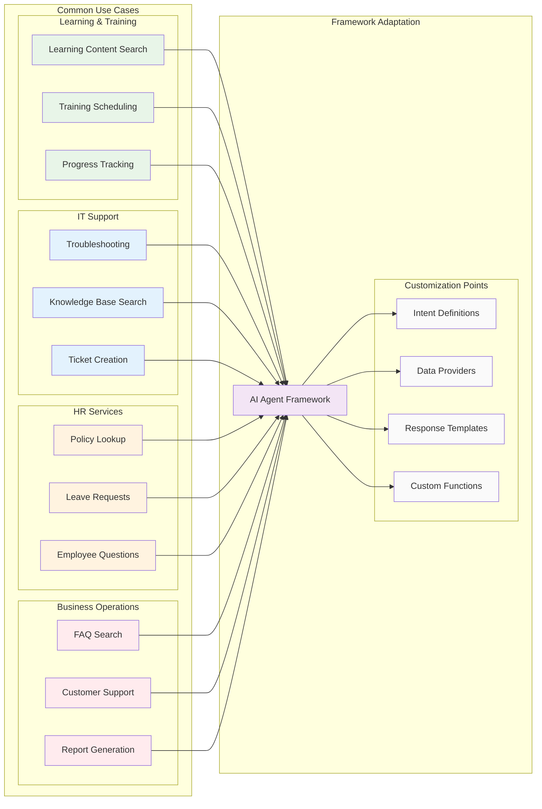
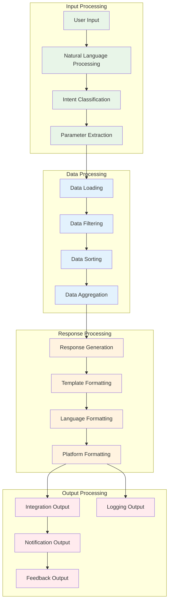

# AI Agent Framework - System Architecture

## 🏗️ Overall Architecture

The AI Agent Framework follows a proven 4-Agent architecture pattern that provides a clean separation of concerns and enables scalable, maintainable AI agent development.

## 🔄 Processing Flow

## 🧩 Component Architecture

## 🔧 Configuration Architecture

## 🚀 Deployment Architecture

## 🎯 Use Case Scenarios

## 🔄 Data Flow Patterns

